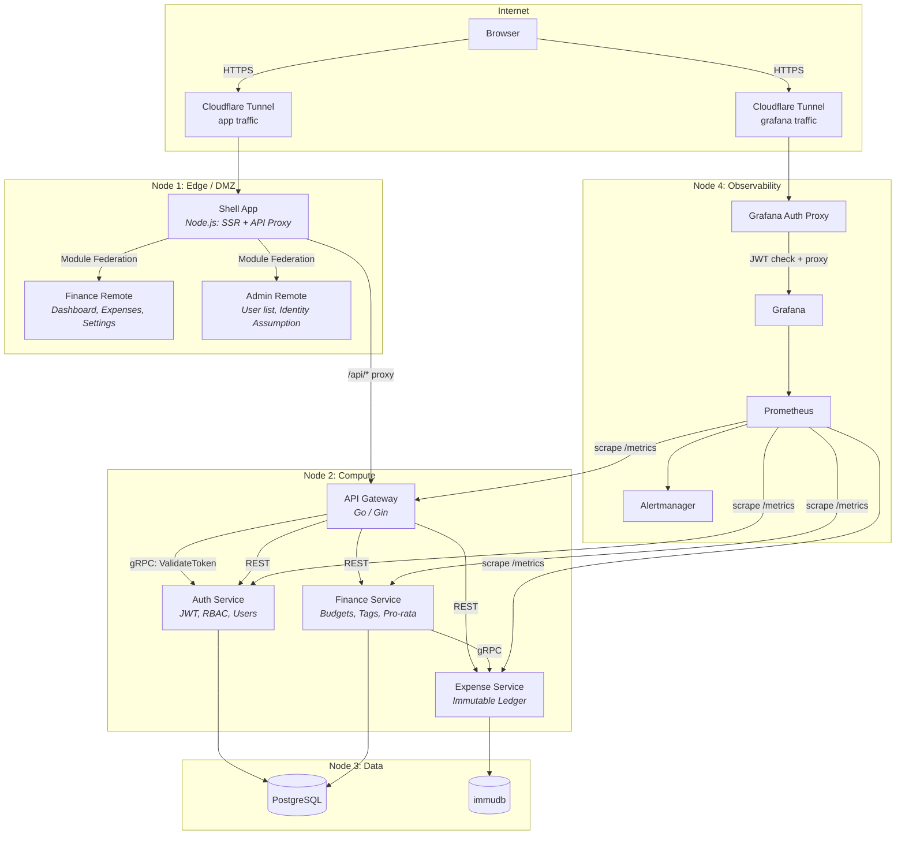

<div align="center">
<pre>
               __ _          
              / _(_)         
   __ _  ___ | |_ _ _ __    
  / _` |/ _ \|  _| | '_ \   
 | (_| | (_) | | | | | | |  
  \__, |\___/|_| |_|_| |_|  
   __/ |                    
  |___/                     

-----------------------------------------------------------------------------------------
An overengineered personal finance tracker built with microservices, 
micro-frontends, and an immutable expense ledger.

</pre>


</div>

## Showcase

https://github.com/user-attachments/assets/44ed82d6-a7b6-499c-90ba-3655cedaf110

## Introduction

gofin is an intentionally overengineered personal finance tracker that lets users set monthly budgets with an essentials/desires/savings split, log expenses, and track spending via a real-time dashboard. It serves a dual purpose: a functional personal finance tool and a learning platform for distributed systems patterns. Key features include an immutable expense ledger backed by [immudb](https://immudb.io/) with bank-style corrections (no edits, only appends), pro-rata expense spreading across multiple months, RBAC with admin identity assumption, and a full observability stack with Prometheus and Grafana.

## Technology Stack

- **Frontend:** React micro-frontends composed at runtime via Module Federation 2.0, with a Node.js SSR shell app
- **Backend:** Go microservices (Gin framework) communicating over REST and gRPC
- **Databases:** PostgreSQL (relational data), immudb (immutable expense ledger)
- **Auth:** JWT with RBAC, Google OAuth, admin identity assumption
- **Observability:** Prometheus, Grafana, Alertmanager
- **Infrastructure:** Docker Compose, Cloudflare Tunnels, single-VPS deployment
- **CI/CD:** GitHub Actions with automated deployment on push to main

## Architecture



| Path | Protocol | Purpose |
|------|----------|---------|
| Browser → Shell | HTTPS (via Cloudflare) | SSR pages, static assets |
| Shell → API Gateway | HTTP reverse proxy | All `/api/*` requests |
| Gateway → Auth Service | gRPC | Token validation on every request |
| Gateway → Services | REST | Routed API calls with trusted user identity |
| Finance → Expense | gRPC | Ledger writes during pro-rata application |
| Services → Databases | SQL / native client | Data persistence |
| Prometheus → Services | HTTP `/metrics` | Metrics collection |

## Usage

### Prerequisites

- [Docker](https://docs.docker.com/get-docker/) and Docker Compose
- [Just](https://github.com/casey/just) command runner
- [Go](https://go.dev/dl/) (see `services/*/go.mod` for version)
- [Node.js](https://nodejs.org/) (see `frontend/package.json` for version)

### Getting Started

```bash
# Copy environment config
cp .env.example .env

# Install dev tooling and activate pre-commit hooks
just setup

# Start the full stack
just up

# Seed the admin user
just seed-admin
```

The app is available at `http://localhost:3000`. Grafana dashboards are at `http://localhost:3001`.

### Frontend Only (Mock Mode)

To work on the UI without running any backend services or Docker containers:

```bash
just dev-mock
```

This starts the shell app with [MSW](https://mswjs.io/) intercepting all `/api/*` requests in the browser. Mock handlers live in `frontend/apps/shell/mocks/`.

### Service-Focused Development

For iterating on a single backend service without rebuilding all containers:

```bash
# Start databases and monitoring only
just dev-infra

# In another terminal: start a specific Go service
just dev-service auth

# In another terminal: start the frontend with hot reload
just dev-frontend
```

### Available Commands

Run `just --list` for the full set of recipes. Key commands:

| Command | Description |
|---------|-------------|
| `just setup` | Install dev tooling and activate pre-commit hooks |
| `just up` | Build and start the full stack |
| `just down` | Stop all containers |
| `just reset` | Stop and remove all volumes (full data reset) |
| `just dev-mock` | Start the frontend with mock API (no backend needed) |
| `just dev-infra` | Start only databases and monitoring |
| `just dev-service <name>` | Run a single Go service locally |
| `just dev-frontend` | Start the Turborepo frontend with hot reload |
| `just test` | Run all backend and frontend tests |
| `just seed-admin` | Create the initial admin user |

## Deployment

gofin runs on a single VPS with Cloudflare Tunnels for ingress. No container registry or orchestrator required.

```bash
scripts/deploy.sh <server-ip>
```

Pushes to `main` automatically deploy after CI passes. See [CI/CD Pipeline](docs/ci-cd.md) for details.

## Further Reading

| Document | Description |
|----------|-------------|
| [Architecture](docs/architecture.md) | Node topology, service boundaries, data flow |
| [Auth System](docs/auth.md) | JWT lifecycle, RBAC model, identity assumption |
| [CI/CD Pipeline](docs/ci-cd.md) | GitHub Actions workflows, required secrets |
| [Data Model](docs/data-model.md) | Database schemas, service ownership |
| [API Reference](docs/api.md) | REST endpoint catalog |
| [Development Guide](docs/development.md) | Local workflow, environment variables |
| [Testing](docs/testing.md) | Test strategy, patterns, coverage |
| [Monitoring](docs/monitoring.md) | Prometheus metrics, Grafana dashboards |
| [Tunnel Setup](docs/tunnel-setup.md) | Cloudflare tunnel creation and DNS routing |
