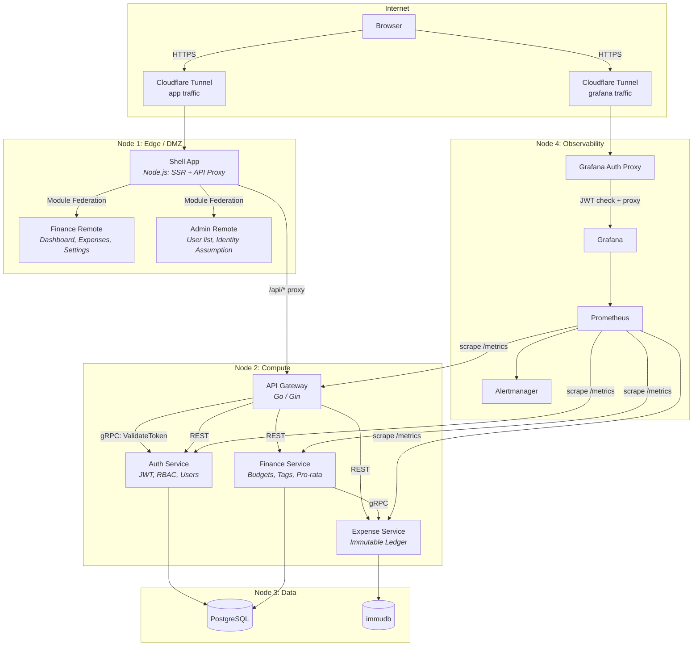

# gofin

An intentionally overengineered personal finance tracker built as a distributed monorepo with microservice architecture, micro-frontend composition, and an immutable expense ledger.

## What It Does

gofin lets users set monthly budgets with an essentials/desires/savings split, log expenses against those budgets, and track spending via a real-time dashboard. It serves a dual purpose: a functional personal finance tool and a learning platform for distributed systems patterns.

**Key capabilities:**

- Monthly budget periods with configurable E/D/S (essentials/desires/savings) split
- Immutable expense ledger backed by [immudb](https://immudb.io/) with bank-style corrections (no edits, only appends)
- Pro-rata expense spreading across multiple months
- Real-time dashboard with budget pacing, category gauges, and spending charts
- RBAC with admin identity assumption for support and debugging
- Full observability stack: Prometheus, Grafana, Alertmanager
- Micro-frontend architecture: independently built apps composed at runtime via Module Federation 2.0

## High-Level Architecture



**Communication patterns:**

| Path | Protocol | Purpose |
|------|----------|---------|
| Browser → Shell | HTTPS (via Cloudflare) | SSR pages, static assets |
| Shell → API Gateway | HTTP reverse proxy | All `/api/*` requests |
| Gateway → Auth Service | gRPC | Token validation on every request |
| Gateway → Services | REST | Routed API calls with trusted user identity |
| Finance → Expense | gRPC | Ledger writes during pro-rata application |
| Services → Databases | SQL / native client | Data persistence |
| Prometheus → Services | HTTP `/metrics` | Metrics collection |

## Quick Start

### Prerequisites

- [Docker](https://docs.docker.com/get-docker/) and Docker Compose
- [Just](https://github.com/casey/just) command runner
- [Go 1.22+](https://go.dev/dl/) (for backend development)
- [Node.js 20+](https://nodejs.org/) (for frontend development)

### One-Command Start

```bash
# Copy environment config
cp .env.example .env

# Start the full stack
just up

# Seed the admin user
just seed-admin
```

The app is available at `http://localhost:3000`. Grafana dashboards are at `http://localhost:3001`.

### Service-Focused Development

For iterating on a single service without rebuilding all containers:

```bash
# Start databases and monitoring only
just dev-infra

# In another terminal: start a specific Go service
just dev-service auth

# In another terminal: start the frontend with hot reload
just dev-frontend
```

### With Cloudflare Tunnels

To expose the app via a temporary public URL:

```bash
docker compose --profile tunnels up -d --build
```

## Available Commands

| Command | Description |
|---------|-------------|
| `just up` | Build and start the full stack |
| `just up-dev` | Start with dev overrides (volume mounts, debug ports) |
| `just down` | Stop all containers |
| `just reset` | Stop and remove all volumes (full data reset) |
| `just dev-infra` | Start only databases and monitoring |
| `just dev-service <name>` | Run a single Go service locally |
| `just dev-frontend` | Start the Turborepo frontend with hot reload |
| `just test` | Run all backend and frontend tests |
| `just test-backend` | Run Go tests across all services |
| `just test-frontend` | Run frontend tests via Turborepo |
| `just test-e2e` | Run Playwright E2E tests (requires running stack) |
| `just lint` | Lint all backend and frontend code |
| `just seed-admin` | Create the initial admin user |
| `just migrate <service> [up\|down]` | Run database migrations |
| `just sqlc <service>` | Regenerate sqlc type-safe query code |
| `just proto <service>` | Regenerate protobuf/gRPC code |
| `just logs <service>` | Tail logs for a specific container |

## Service Ports

| Service | HTTP | gRPC | Purpose |
|---------|------|------|---------|
| Shell (MFE) | 3000 | — | SSR frontend + API reverse proxy |
| API Gateway | 8080 | — | Auth-validating reverse proxy |
| Auth Service | 8081 | 9081 | JWT, RBAC, user management |
| Expense Service | 8082 | 9082 | Immutable expense ledger |
| Finance Service | 8083 | 9083 | Budgets, tags, aggregations |
| PostgreSQL | 5432 | — | Relational storage |
| immudb | 3322 | — | Append-only ledger storage |
| Prometheus | 9090 | — | Metrics collection |
| Grafana | 3001 | — | Dashboards and visualization |

## Further Reading

| Document | Description |
|----------|-------------|
| [Architecture](docs/architecture.md) | Node topology, service boundaries, data flow, and design decisions |
| [Auth System](docs/auth.md) | JWT lifecycle, RBAC model, identity assumption, Grafana auth proxy |
| [Data Model](docs/data-model.md) | Database schemas, service ownership, cross-service references |
| [API Reference](docs/api.md) | REST endpoint catalog with request/response shapes |
| [Development Guide](docs/development.md) | Local workflow, environment variables, code generation |
| [Testing](docs/testing.md) | Test strategy, patterns, and how to run each layer |
| [Monitoring](docs/monitoring.md) | Prometheus metrics, Grafana dashboards, alerting rules |
