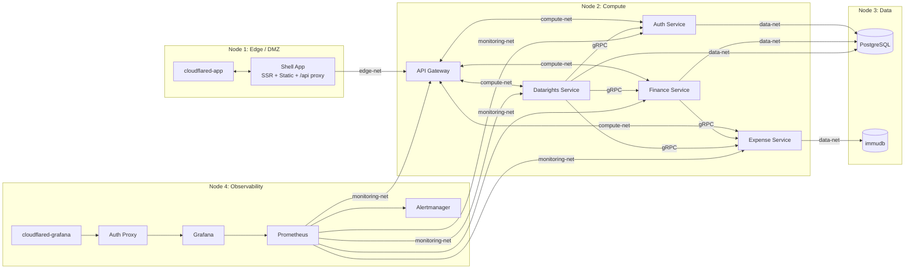
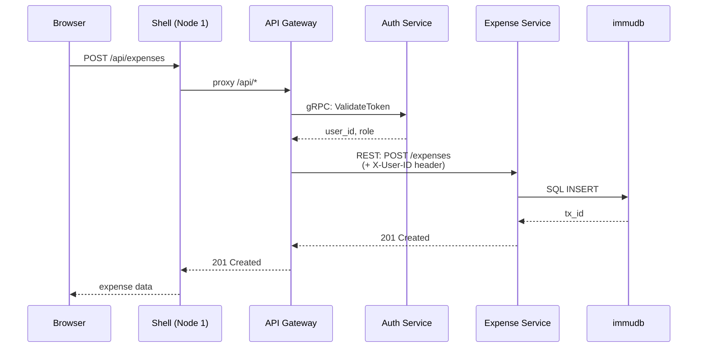
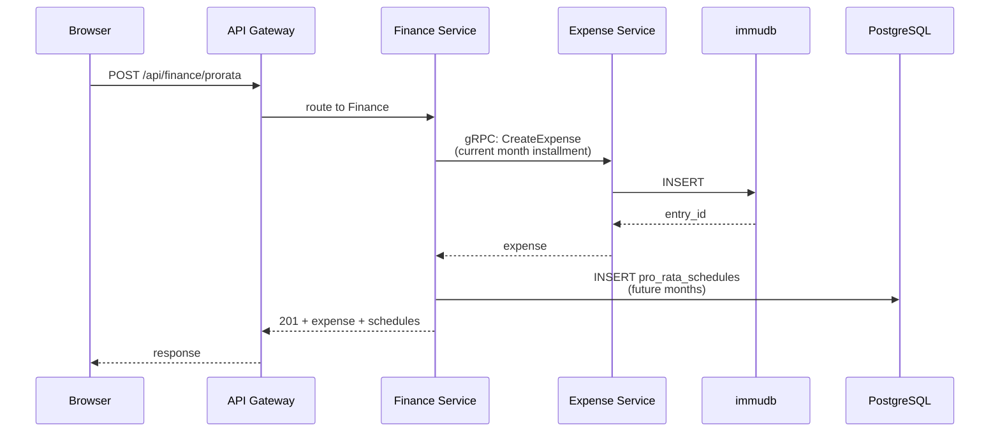
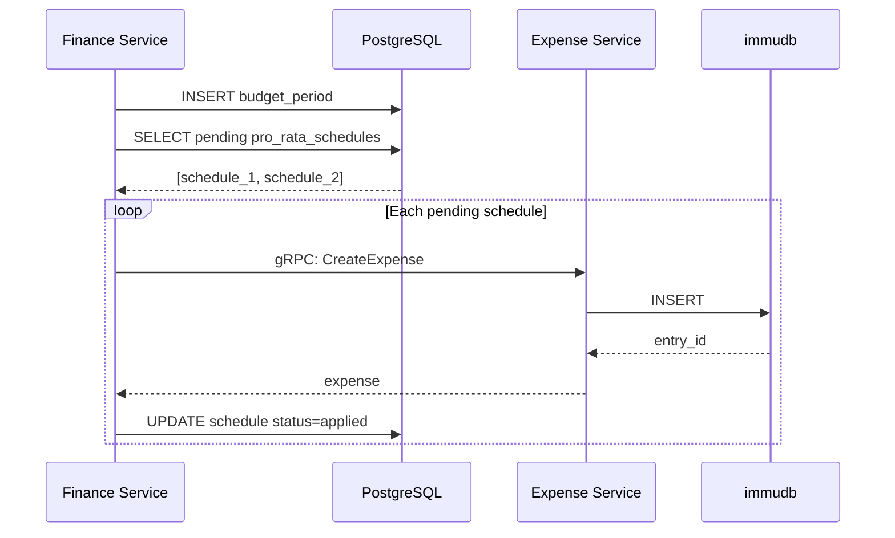
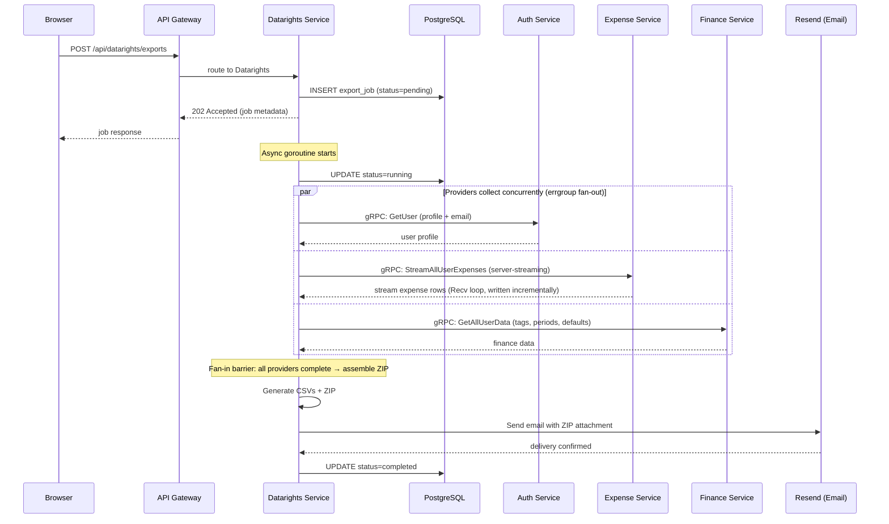

# Architecture

## Overview

gofin is organized as a monorepo with four logical nodes, each representing a group of containers on a shared Docker network. Services communicate via REST (browser-facing) and gRPC (inter-service), with strict network isolation enforced by Docker bridge networks.

## Node Topology

## Service Responsibilities

### Shell App (Node 1)

The shell is the deepest module in the frontend. It is the only app rendered directly: finance and admin apps export page components loaded at runtime via Module Federation.

The shell owns:

- **SSR**: server-side rendering via React Router for fast initial page loads
- **API Proxy**: reverse proxies all `/api/*` requests to the API Gateway on Node 2, keeping the gateway off the public internet
- **Routing**: the complete route tree; remotes export page components, not routed applications
- **Auth Context**: a Zustand store shared across all remotes via Module Federation's shared scope
- **Layout**: persistent navbar, admin assumption banner, mobile navigation
- **Auth Guards**: route protection (unauthenticated, authenticated, onboarding, and a direct-admin guard that redirects operators off personal finance routes to `/admin`)

### API Gateway (Node 2)

A lightweight Go/Gin reverse proxy that validates auth and routes requests. A single centralized `AccessControl` middleware backed by the shared `services/access` route registry classifies every route into one of four access levels (Public / Authenticated / Personal / Admin) and enforces it:

1. Strips client-supplied identity headers so they cannot be spoofed
2. Resolves the route's access level from the shared registry, matching the concrete route gin will dispatch to (else the deny-by-default fail-safe: an unclassified path is refused with **403**, so a route or whole prefix is dead until it is added to the registry with an access level)
3. `Public` routes pass with no token read (e.g. `/api/auth/register`, `/api/auth/login`, `/api/auth/refresh`, `/health`, `/metrics`)
4. Otherwise verifies the `gofin_access` cookie via Auth Service gRPC `ValidateToken` (401 on failure) and injects `X-User-ID`, `X-User-Role`, and (when assuming) `X-Assumed-By`
5. Enforces the level's role: `Personal` routes require `role == "user"` and `Admin` routes require `role == "admin"` (403 on mismatch)

This one middleware replaced the former `unauthenticatedRoutes` allowlist, `RequireAdmin`, and `AdminRouteGuard`. Because the personal finance routes are `Personal`, a direct admin is refused there while an assumed regular-user session passes.

The set of proxied prefixes and their downstream services is itself a single source of truth (`services/access.ProxyPrefixes`), from which the gateway derives its proxy wiring; a cross-check test pins it to the registry so every classified route sits under a proxied prefix and every proxied prefix has at least one classified route.

### Auth Service (Node 2)

Owns user identity, credentials, and token lifecycle:

- User registration and login (bcrypt password hashing)
- JWT access/refresh token generation and validation
- Refresh token rotation with blacklist-based revocation
- Password change with bulk token invalidation (`tokens_revoked_at` timestamp)
- RBAC enforcement (user/admin roles; `admin` is operator-only and owns no finance data)
- Admin identity assumption and restoration

### Expense Service (Node 2)

Owns the immutable expense ledger backed by immudb:

- Append-only expense writes (no updates, no deletes)
- Correction mechanics: new entries supersede originals, forming a correction chain
- Materialized view: filters to `status=active` so downstream consumers see only current truth
- Pro-rata installment tracking (group ID, index, total)

### Finance Service (Node 2)

The business logic hub, orchestrating budgets, tags, and dashboard data:

- Budget period lifecycle (creation, missed-month backfill, E/D/S allocation)
- Pro-rata scheduling: stores future installment schedules in PostgreSQL, creates ledger entries via Expense Service gRPC when periods are created
- Tag CRUD with lazy-seeded defaults
- Dashboard aggregation: period summary, pacing, category breakdowns, cumulative spend, historical comparison

### Datarights Service (Node 2)

Owns GDPR data export and user data portability (Article 20 compliance):

- Async export job lifecycle (pending → running → completed/failed)
- Data collection from upstream services via gRPC (Auth, Expense, Finance)
- CSV generation per data category with a provider-based extension model
- ZIP assembly and email delivery via Resend
- 30-day rate limiting between successful exports
- In-progress job deduplication (idempotent POST)
- Startup recovery: re-submits non-terminal jobs found in the database
- Bounded concurrency pool with configurable max concurrent exports

The service coordinates data collection from all other compute services but owns no user data itself: it only stores job metadata (status, timestamps, file size) in its own PostgreSQL schema.

### Databases (Node 3)

- **PostgreSQL**: single instance with three schemas (`auth`, `finance`, `datarights`), each accessed by its owning service via separate credentials. Logical isolation with the option to split later.
- **immudb**: append-only storage for expense ledger entries. SQL interface for queries, native Go client for writes.

### Observability Stack (Node 4)

- **Prometheus**: scrapes `/metrics` from all Go services on the compute network
- **Alertmanager**: routes alerts based on Prometheus rules
- **Grafana**: pre-provisioned dashboards for system overview, per-service metrics, and database health
- **Auth Proxy**: a small Go service that validates JWTs and checks admin role before proxying to Grafana

## Network Isolation

Four Docker bridge networks enforce traffic boundaries:

| Network | Connects | Traffic |
|---------|----------|---------|
| `edge-net` | MFE, cloudflared-app, API Gateway | Public-facing traffic only |
| `compute-net` | API Gateway, all microservices (Auth, Expense, Finance, Datarights) | Internal service communication |
| `data-net` | Microservices, PostgreSQL, immudb | Database access only |
| `monitoring-net` | Prometheus, Grafana, Alertmanager, auth proxy, all microservices (for /metrics) | Observability plane |

Databases are never reachable from `edge-net`. The browser only communicates with the shell app, which proxies everything else.

## Key Design Decisions

| Decision | Rationale |
|----------|-----------|
| Single-origin reverse proxy (Node 1 → Node 2) | Avoids cross-origin cookie issues with trycloudflare.com public suffix domains |
| gRPC inter-service, REST browser-facing | gRPC gives binary protocol and generated types between Go services; REST is browser-native |
| immudb for expense ledger | True append-only storage with cryptographic verification; corrections modeled as new entries |
| sqlc for PostgreSQL services | SQL-first, type-safe generated Go code without ORM magic |
| Module Federation 2.0 (Vite) | Independent app builds with runtime composition; no cross-origin issues since shell serves all remotes |
| JWT in httpOnly cookies | XSS-proof token storage; automatic inclusion by the browser; works naturally with the reverse proxy |
| Zustand shared via Module Federation | Lightweight state management that works across the MF host/remote boundary |
| Finance service orchestrates pro-rata | Simpler than a saga for a 5-user system; finance calls expense directly, rolls back on failure |
| Just command runner | Polyglot support (Go, Node, Docker) with readable syntax; better than Makefiles for this use case |

## Data Flow: Logging an Expense

## Data Flow: Pro-rata Expense

## Data Flow: New Month Period Creation

When a new month is accessed and pending pro-rata installments exist:

## Data Flow: Data Export

When a user requests a data export, the datarights service collects data from all upstream services concurrently in a background goroutine (an `errgroup` fan-out, with ZIP assembly as the fan-in barrier) and delivers the result via email:

